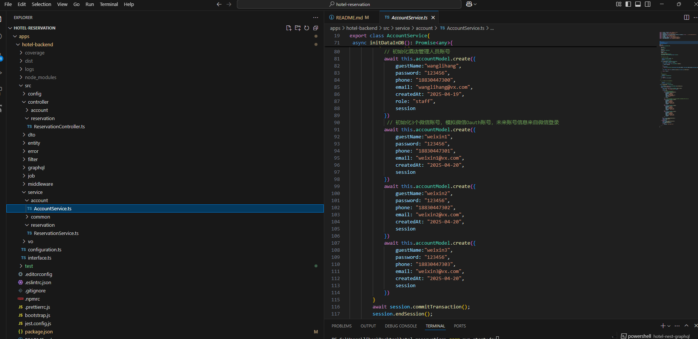
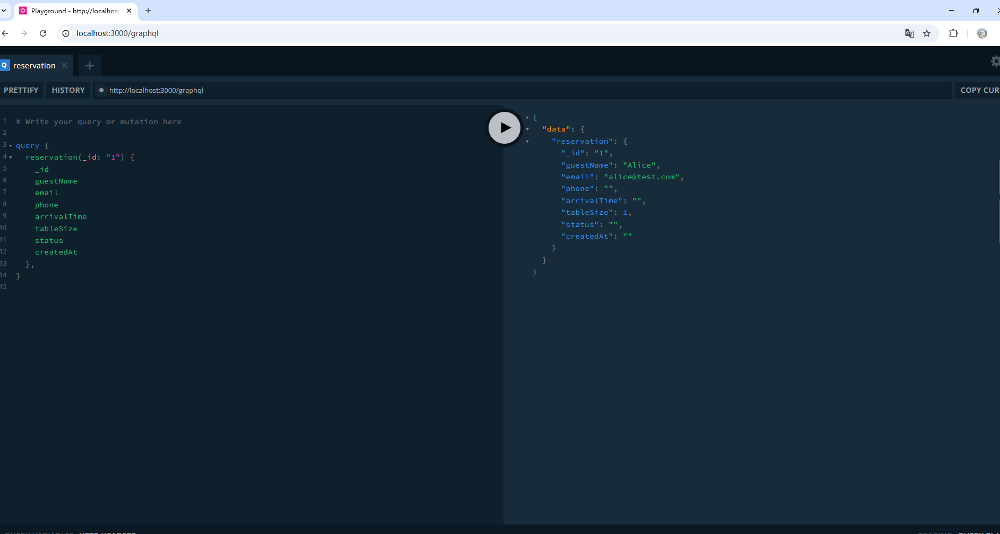
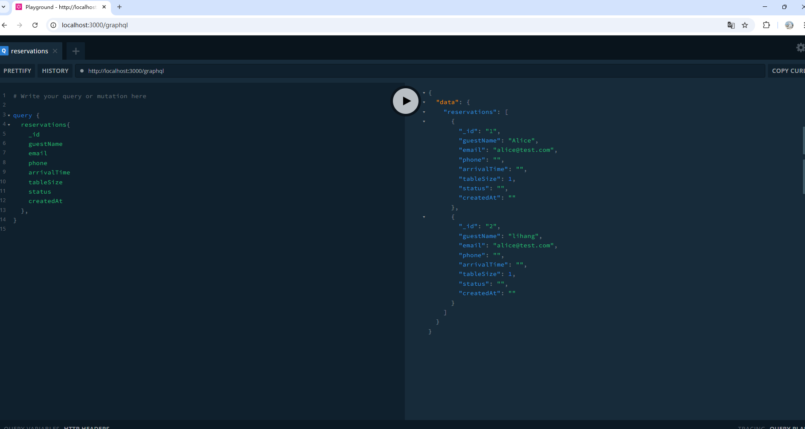
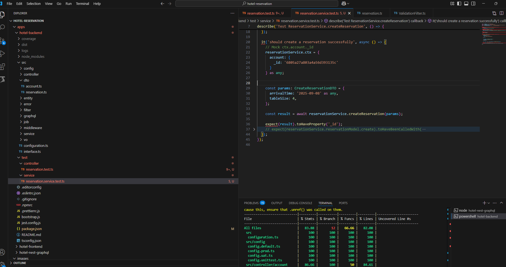

# 酒店预订系统


## 运行
```
1. 进入项目根目录，运行docker compose up，把数据跑起来
2. 进入 hotel-backend目录下，执行pnpm run dev
3. 进入 hotel-frontend目录下，执行pnpm run dev
4. 在浏览器输入 localhost:8000,可看到效果

可选 进入 hotel-nest-graphql目录下,执行
pnpm run start:dev 
```
## 效果如下所示
<video src="./images/1.mp4" controls width="600"></video>

## 初始化的用户名和密码,包括酒店员工端和客户

## 技术选型
```
后端： midwayjs
前端： reactjs
Nosql： mongodb
```

## 项目管理方式
```
monorepo

在app目录下有三个项目

hotel-backend 为后端项目，提供用户授权，预定功能

hotel-front 为前端项目，提供ui展示

hotel-nest-graphql 这个项目，用nestjs框架集成
```




## 单元测试
